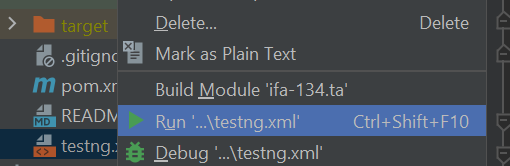

# ifa-134.ta

How to run Test Suite

or use Maven command
mvn clean test -DsuiteXml=*fileName.xml*

## Allure
### Getting started
Before generating your reports Allure commandline application needs to be installed.

To do so, please visit [this](https://docs.qameta.io/allure/#_get_started) page and follow simple instructions.

### Reports
Allure reports are generating in a folder **target/allure-results**.

To generate a report:
* run your tests with `mvn clean test` or similar command.

To see a report:
1. run: `allure serve target/allure-results` in terminal;
2. allure report page will automatically open in your browser.

